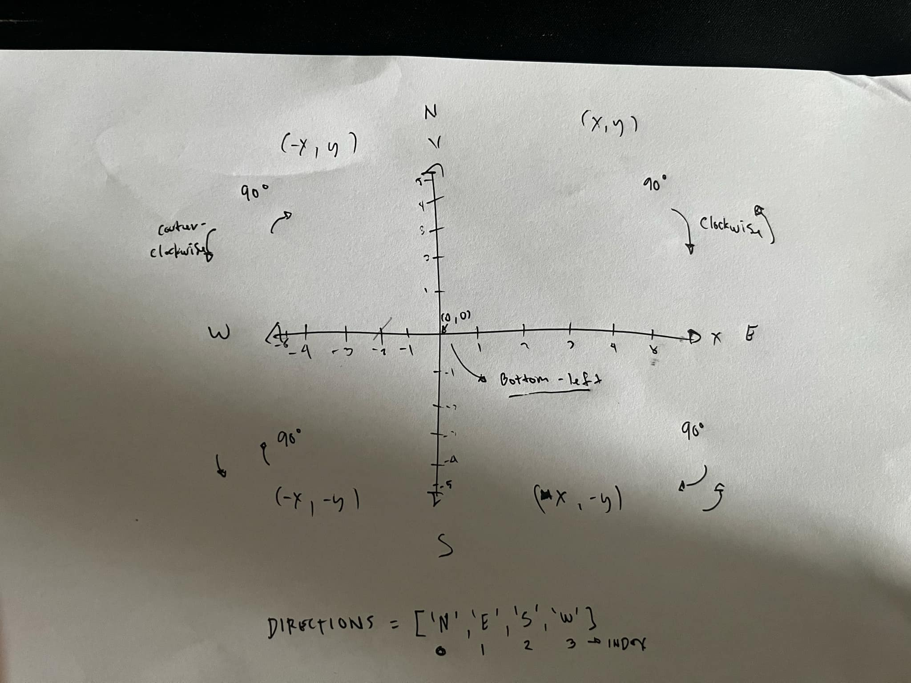
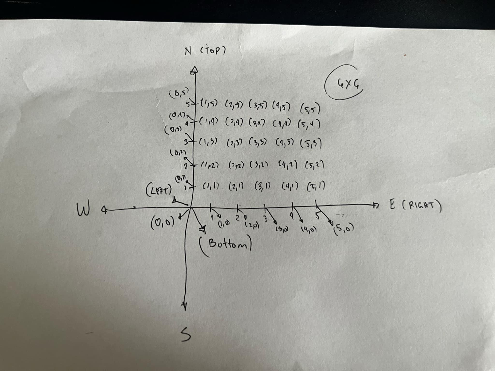

# Robot Movement Simulation

## Documentation

You can refer to the [bare code test interview process](bare-code-test-interview-process.pdf) for more details.

## Prerequisites

Make sure you have Ruby 3.3.5 installed on your system.

## Running the Application

To run the simulation, simply execute the following command in your terminal:

```bash
ruby app.rb
```

## Images

### Cartesian Plane with Directions


### Cartesian Plane Identifying Coordinates


## Videos


or this link: https://www.loom.com/share/09a5c09adc7a417a8a50da0ff3ddf3f6?sid=4f374d60-9325-4be8-9a90-ce0f698459a4
